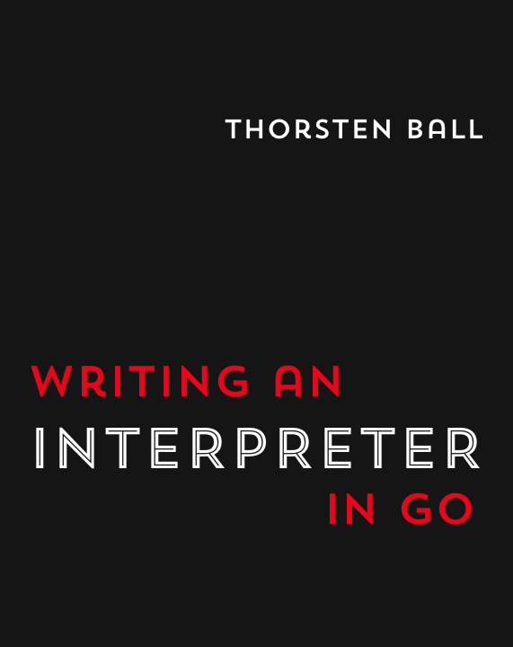

# rust-interpreter

This repository follows the book [Writing an Interpreter in Go](https://interpreterbook.com/) and implements the code in Rust.

[](https://interpreterbook.com/)

## Run

```bash
cargo run
```

## Architecture

The interpreter is built in three main stages:

1. **Lexer** — tokenizes the input source code.
2. **Pratt parser** — builds an AST from the tokens.
3. **Evaluator** — walks the AST and executes the program.

Additional tests are in `evaluator/tests.rs`.

## Features

- Integers, strings, booleans
- Arrays and hashes with index access
- `let` bindings, `return` statements, and `if/else` expressions
- First-class functions and closures

## Project structure

| Module | Purpose |
|--------|---------|
| `lexer` | Tokenizes source input |
| `parser` | Pratt parser that produces an AST |
| `ast` | AST node definitions |
| `object` | Runtime values and environment |
| `evaluator` | Tree-walking evaluator |
| `repl` | Interactive REPL |

## Tests

```bash
cargo test
```
